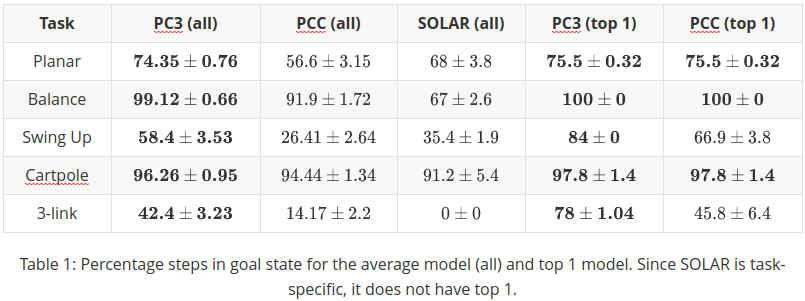
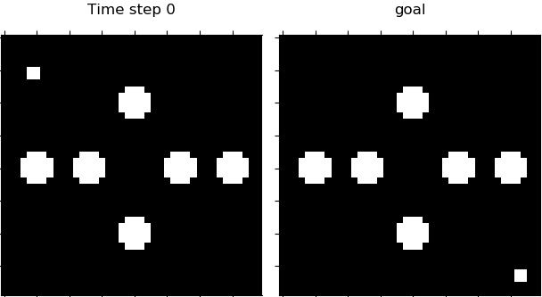
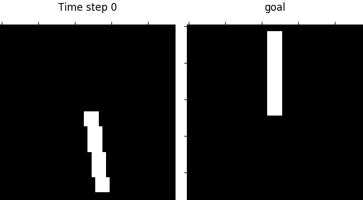
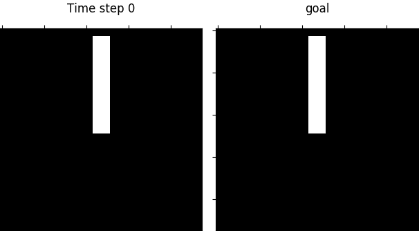
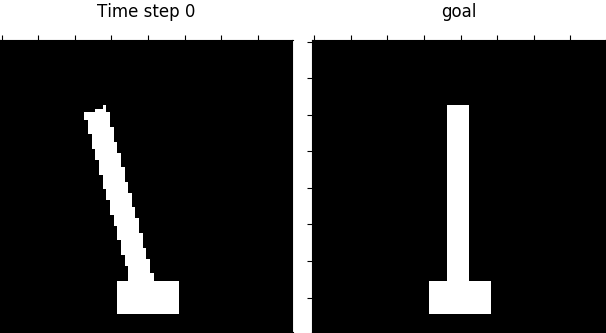
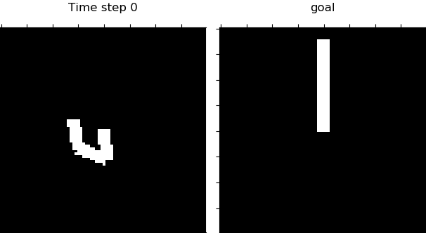
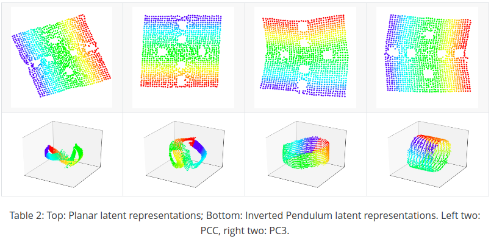

# Predictive Coding for Locally-Linear Control

This is a pytorch implementation of the paper "[Predictive Coding for Locally-Linear Control](http://proceedings.mlr.press/v119/shu20a.html)". We propose PC3 - an information-theoretic representation learning framework for optimal control from high-dimensional observations. Experiments show that our proposed method outperforms the existing reconstruction-based approaches significantly. The work was done during the residency at [VinAI Research](https://vinai.io), Hanoi, Vietnam.

## Installing

First, clone the repository:

```
https://github.com/VinAIResearch/PC3-pytorch.git
```

Then install the dependencies as listed in `pc3.yml` and activate the environment:

```
conda env create -f pc3.yml
conda activate pc3
```

## Training

The code currently supports training for `planar`, `pendulum`, `cartpole` and `3-link` environment. Run the `train_pc3.py` with your own settings. For example:

```
python train_pc3.py \
    --env=planar \
    --armotized=False \
    --log_dir=planar_1 \
    --seed=1 \
    --data_size=5000 \
    --noise=0 \
    --batch_size=256 \
    --latent_noise=0.1 \
    --lam_nce=1.0 \
    --lam_c=1.0 \
    --lam_cur=7.0 \
    --norm_coeff=0.1 \
    --lr=0.0005 \
    --decay=0.001 \
    --num_iter=2000 \
    --iter_save=1000 \
    --save_map=False
```

First, data is sampled according to the given data size and noise level, then the PC3 model will be trained using the specified settings.

If the argument `save_map` is set to True, the latent map will be drawn every 10 epochs (for planar only), then the gif file will be saved at the  same directory as the trained model.

You can also visualize the training process by running ``tensorboard --logdir={path_to_log_dir}``, where ``path_to_log_dir`` has the form ``logs/{env}/{log_dir}``. The trained model will be saved at ``result/{env}/{log_dir}``.

### Latent maps visualization

You can visualize the latent map for planar and pendulum, to do that simply run:

```
python latent_map_planar.py --log_path={log_to_trained_model} --epoch={epoch}
or 
python latent_map_pendulum.py --log_path={log_to_trained_model} --epoch={epoch}
```

## Data visualization

You can generate the training images for visualization by simply running:

```
cd data
python sample_{env_name}_data.py --sample_size={sample_size} --noise={noise}
```

Currently the code supports simulating 4 environments: `planar`, `pendulum`, `cartpole` and `3-link`.

The raw data (images) is saved in data/{env_name}/raw\_{noise}\_noise

## Running iLQR on latent space

The configuration file for running iLQR for each task is in ``ilqr_config`` folder, you can modify with your own settings. Run:

```
python ilqr.py --task={task} --setting_path={setting_path} --noise={noise} --epoch={epoch}
```

where ``task`` is in ``{plane, swing, balance, cartpole, 3-link}``, `setting_path` is the path to the model of your 10 trained models (e.g., result/pendulum/).

The code will run iLQR for all trained models for that specific task and compute some statistics. The result is saved in ``iLQR_result``.

## Result
### Quantitative result

We compare PC3 with two state-of-the-art LCE baselines: PCC ([Levine et al., 2020](https://openreview.net/pdf?id=BJxG_0EtDS)) and SOLAR ([Zhang et al.,
2019](http://proceedings.mlr.press/v97/zhang19m/zhang19m.pdf)). Specifically, we report the percentage of time spent in the goal region in the underlying system.



Below are videos showing learned policy in 5 tasks.











### Qualitative result

We also compare the quality of learned latent maps between PCC and PC3 in planar and pendulum.



### Acknowledgment

### Citation
Details of the model architecture and experimental results can be found in our [following paper](http://proceedings.mlr.press/v119/shu20a.html):
```
@InProceedings{pmlr-v119-shu20a,
  title = 	 {Predictive Coding for Locally-Linear Control},
  author =       {Shu, Rui and Nguyen, Tung and Chow, Yinlam and Pham, Tuan and Than, Khoat and Ghavamzadeh, Mohammad and Ermon, Stefano and Bui, Hung},
  booktitle = 	 {Proceedings of the 37th International Conference on Machine Learning},
  year = 	 {2020},
  volume = 	 {119},
  series = 	 {Proceedings of Machine Learning Research},
  publisher =    {PMLR},
}
```
**Please CITE** our paper whenever this repository is used to help produce published results or incorporated into other software.
